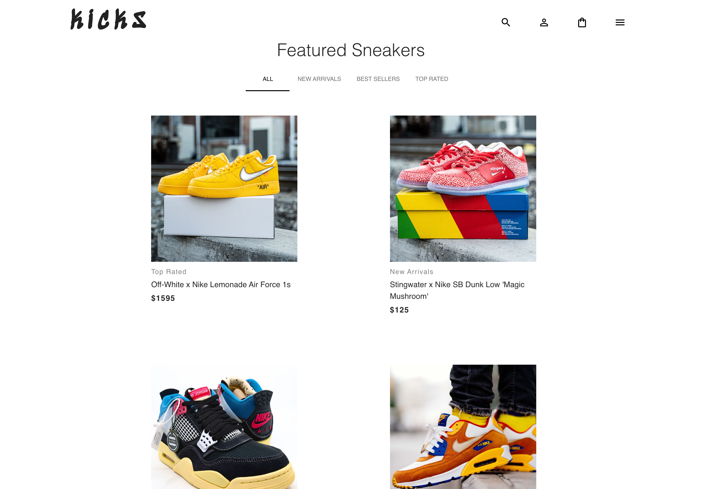
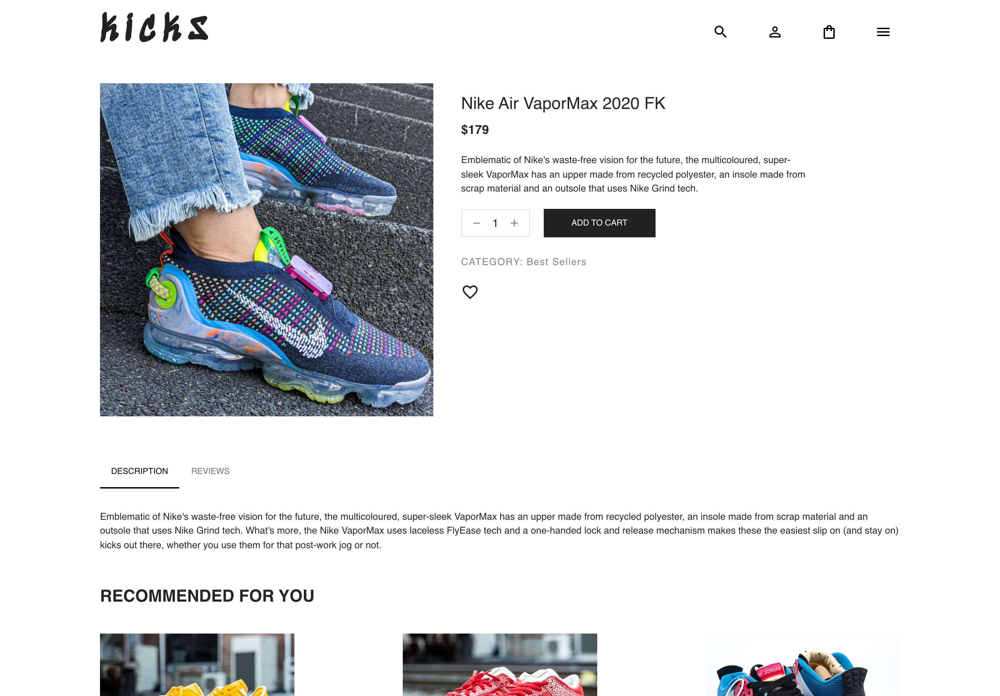

# Kicks 👟

An e-commerce platform for sneaker nerds.

## Table of contents

- [Overview](#overview)
  - [Description](#description)
  - [Project Goal](#project-goal-✨)
  - [Screenshots](#screenshots)
  - [Links](#links)
- [My process](#my-process)
  - [Tech Stack](#tech-stack-🧙‍♂️)
- [Author](#author)

## Overview

### Description

The ultimate online destination for sneaker enthusiasts. We offer a carefully curated selection of premium quality sneakers from the hottest brands. Shop our latest drops, limited-edition releases, and classic styles with lightning-fast shipping. Join our community of like-minded sneakerheads on social media and take your sneaker game to the next level.

### Project Goal ✨

The reason I chose this project was because in the past I had designed and worked with a developement team in order to bring my marketplace startup idea to life. Now I want to understand how everything works in order to create an e-commerce website, how to work with a headless CMS like Strapi and how to handle payments using Stripe!

E-commerce is at the heart of the web, and so I think it is super important to have a good understanding of how to build a project like this. Also, it's highly likely that any potential web devlopement work I will do in the future will include managing products, payments, etc ...

### Screenshots

### Links

- [Live Demo](https://nextjs-kicks-ecommerce.vercel.app/)

- [Strapi Server Repo](https://github.com/UnionPAC/strapi-kicks) - This powers the backend Strapi CMS server, which is responsible for hosting the product catalog and more.

## My process

### Tech Stack 🧙‍♂️

**Frontend:**

- Next.js
- Material UI
- Redux
- Stripe
- Formik
- Strapi

**Backend**

- Strapi (CMS)

## Author

- Website - [Geoff Jamieson](https://www.geoffjamieson.com/)
- LinkedIn - [linkedin/geoffjamieson](https://www.linkedin.com/in/geoffjamieson/)
